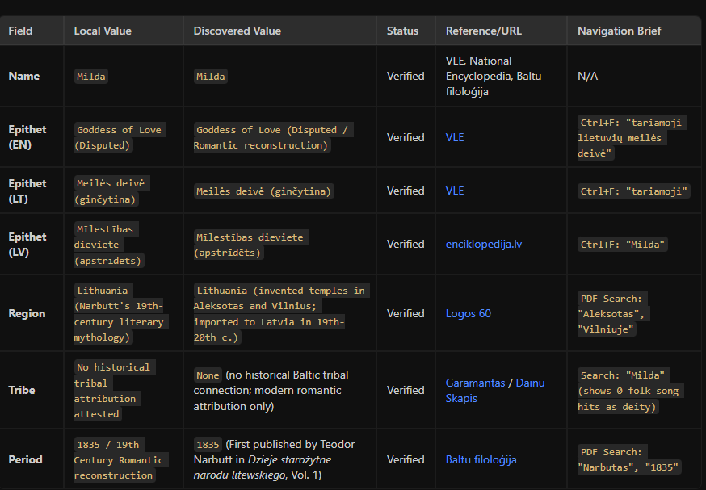

# Gods, agents and confidence levels

Context: work presentation for NordSecurity. 

Audience: both technical and non-technical people, however all working in NordSecurity, all aware about AI, some are using AI tools frequently, others less frequently.

Goal: show how agents and skills across different AI tools like ChatGPT, Gemini, Claude, Antigravity, GitHub Copilot, Cursor, etc. can be reused in orchestrated agent workflows.

## My own intro

Engineering manager with 10+ years of experience in IT.
Spent last 3 years experimenting with AI development, during which:
- Built over a hundred agents for different purposes.
- Quite early in AI maturity wrote a book on how to apply it without sacraficing quality.
- Worked on a few prototypes like a baltic mythology website and a soundboard and ambience mixer for D&D.

Today I would like to share some insights and ideas about this journey, specifically researching part of my baltic mythology project.

## Introduction

This is Perkūnas. Lithuanian god of thunder, sky, storm, forests, rain, sea and war. In this picture you can see him in a carriage pulled by 3 goats with an axe in his hand.


Looks cool, right? Except that goats are sacraficed to Perkūnas, he doesn't ride them. Also he uses a sword and not an axe. This looking good image is very incorrect.

So I wondered - what can I do to solve this problem?

## Not an expert

I'm not a historian or a mythologist. I'm an engineer. But I can Google and googling I did.
It was very tedious, because records about baltic mythology are stored in very primitive sites, scattered and sometimes inconsistent between each other. this manual work is boring - can it be automated?

## Let's try to use AI tools

### Agents

At the time I put everything in agents. My setup was:
- Browser researcher agent gets data about a given deity by googling
- Editor agent review what I have in my repository and flags inconsistencies
- FE dev agent implements

When asking to "fact check Perkunas" it sometimes would spawn a subagent, in other times just read their instructions in other times I wouldn't even know whether the agent was used. I had better results when being explicit. In any case - it kind of worked.

I had a similar flow for researching a new thing, which includes one more agent - LLM researcher.
In this flow LLM researcher and browser researcher work in parallel, editor agent reviews their findings and flags inconsistencies, then FE dev agent implements.

It was a bit weird, because I mentioned about the same 2 flows in all 4 agents - so x4 the duplication of the same instructions.

And inconsistent flows.

### Skills

My agents were heavy and did a lot. I decided to make them leaner, focusing on their behavior and what tools do they have access for, where to look for information.

The part where the whole flow is orchestrated was split into two: 
- Fact check
- Research

#### Fact check skill

Review what information there already is about a deity, location or a tale and fact check it.
Or write a sentence and fact check it.

It comes down to:
- Spawn x2 browser researches:
    - One googles in LT
    - The other googles in LV
- In the end produce a table like this:



Note: when extracting some agents behavior into skills I also have come up with an idea that an agent can also read public PDF files - so it's not just googling and reading websites, it's also inspecting PDFs.

#### Research skill

Similar, but instead of verifying existing information, this is for coming up with new information and verifying that.

It comes down to:
- Spawn x1 LLM researcher
- Spawn x2 browser researches
- Editor agents cross checks the info
- FE dev agents implements the UI

## The problem

I was using different AI tools for different purposes:
- GitHub CoPilot for prototyping
- Gemini and Antrigravity - for quick fixes and research

Since at the time GitHub CoPilot was cheap - I used it for pretty much everything.
But here comes the problem - even though agents and skills use the same standard (for the common stuff):

```
---
name: example-skill
description: test
---

<Your instructions go here>
```

To make this work in different tools - I didn't think much and let AI copy-paste and manage them throught .github, .gemini and .antigravity folders. The more time I spent with the project, the more frustrated I was - even though I managed those agent configs with AI, it was making changes inconsistent, leaving me with 3 different versions of the same. 5 AI agents. Duplicated 3 times... This had to be fixed.

## The solution

3 folders having the same folders: /agents and /skills. How to reuse the skills and agent definitions across tools? 

I started by moving all of my skills and agents to a common directory .ai. 
Then I created **symlinks** to every folder in it:

.ai/agents -> .gemini/agents
.ai/skills -> .gemini/skills

.ai/agents -> .antigravity/agents
.ai/skills -> .antigravity/skills

.ai/agents -> .github/agents
.ai/skills -> .github/skills

It works even if your skills/agents have extra frontmatter fields - so just have it all the frontmatter fields mixed - what is not used will be ignored.

### Edge cases

#### Gemini couldn't load more complicated agents/skills

Gemini didn't like extra frontmatter fields - refused to load the agents/skills with those. So I made them lean because I am good with the defaults. However if you want to make full use of Claude - there are more than 20 frontmatter fields.

## Reusing skills across projects

I have the following skills that I like using no matter what project I am at:

- markdown to slides - for visualizing some concept, understanding or presenting something (like this presentation)
- agent-designer - for designing agents and workflows with them
- skill-writer - for writing new skills
- cd-cd-pipeline-builder - all projects need local-> production + quality gate
- commit-writer - writing semantic commits (bug/feat !- breaking change..)
- improving-agent - for editing agents and skills after they made a mistake

## Conclusion

Use AI to automate boring stuff.
Never trust AI blindly.
Automate fact-check through real digital resources.
Then fact check those.

Switching AI tools and skills is easy - use symlinks.